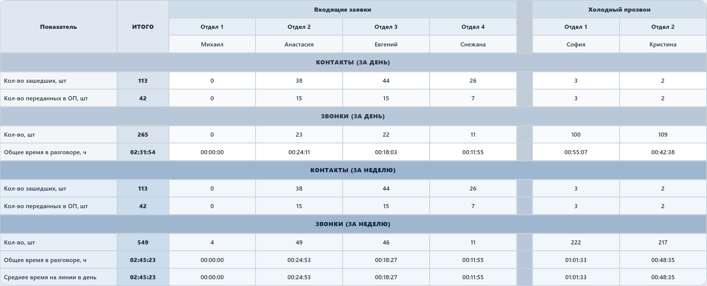
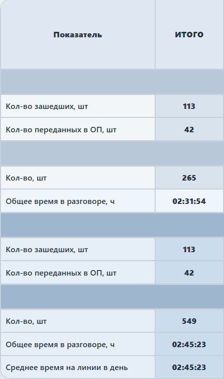
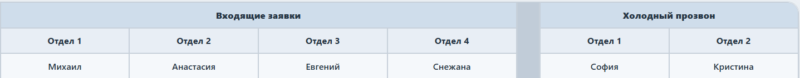

# Дешборд контроля заявок и звонков для Bitrix24

Публичная версия дешборда для контроля входящих заявок, исходящего прозвона и активности сотрудников по звонкам.

## Что показывает проект

- обработку входящих заявок;
- передачу контактов в отдел продаж;
- исходящий прозвон;
- количество звонков за день и неделю;
- общее время разговоров;
- среднее время на линии;
- автообновляемую таблицу для монитора руководителя.

## Особенности реализации

- PHP-дашборд для размещения внутри Bitrix24;
- демо-режим с синтетическими данными для безопасной публикации;
- отдельный провайдер данных для Bitrix24 CRM и телефонии;
- агрегация показателей за день и неделю;
- расчёт количества контактов, переданных в отдел продаж;
- подсчёт звонков и общего времени разговоров;
- автообновление страницы каждые 5 минут;
- адаптированная таблица для вывода на монитор руководителя.

## Интеграция

В рабочей версии дешборд может получать данные из:

- Bitrix24 CRM;
- сделок и пользовательских CRM-полей;
- таблицы телефонии `b_voximplant_statistic`.

Публичная версия использует синтетические данные и не содержит реальных сотрудников.

## Скриншоты

### Главный экран

### Метрики

### Таблица сотрудников

